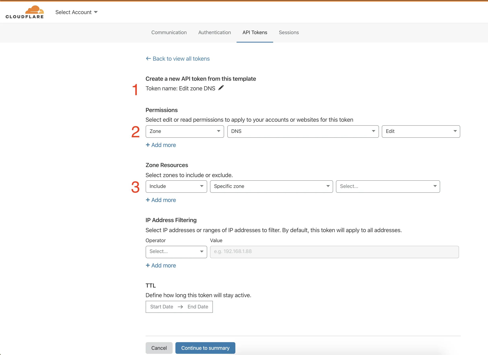
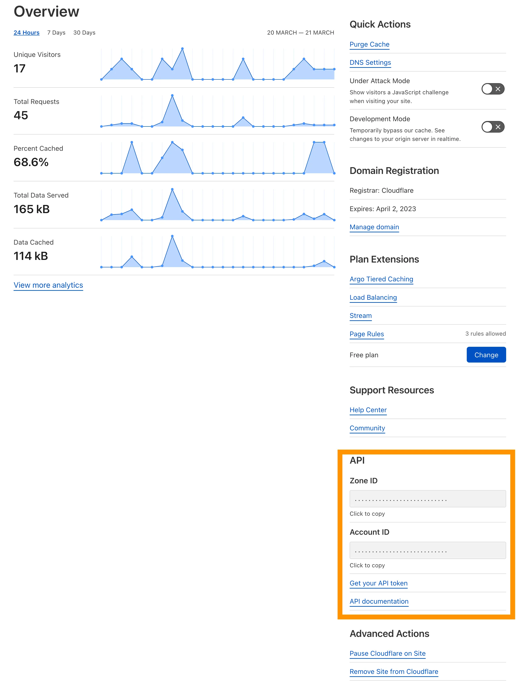

# Hay Fútbol

Plugin de WordPress que detecta automaticamente si hay partidos de LaLiga en curso y si la IP de tu servidor aparece en los listados de bloqueo de operadoras espanolas. Cuando tu IP esta bloqueada, desactiva el proxy de Cloudflare para que tu sitio siga siendo accesible. Cuando el bloqueo se levanta, reactiva el proxy solo.

## Requisitos

- WordPress 5.0 o superior
- PHP 7.1 o superior
- Tu dominio gestionado en Cloudflare

## Instalacion

1. Ve a la pagina de [releases](https://github.com/alex-rivas-v/hayfutbol/releases) y descarga el archivo `.zip` de la ultima version.
2. En WordPress, ve a **Plugins > Anadir nuevo > Subir plugin** y sube el `.zip`.
3. Activa el plugin.
4. Ve a **Ajustes > Hay Futbol** y configura tus credenciales de Cloudflare.

## Configuracion

Necesitas tres datos de tu cuenta de Cloudflare:

### 1. API Token

Ve a [dash.cloudflare.com](https://dash.cloudflare.com) > icono de cuenta > *My Profile* > pestana *API Tokens* > *Create Token*. Usa la plantilla **Edit zone DNS** y selecciona la zona de tu dominio.

### 2. Zone ID

Panel de Cloudflare > selecciona tu dominio > pestana *Overview* > columna derecha, seccion *API*.

### 3. DNS Record ID

Guarda primero el token y el Zone ID, luego pulsa **Auto-detectar**. El plugin busca automaticamente el registro A de tu dominio en Cloudflare y lo preselecciona. Si lo ejecutas en local, muestra la lista completa para que elijas manualmente.

## Panel de estado

Una vez configurado puedes ver el estado actual en **Ajustes > Hay Futbol**:

| Card | Descripcion |
|------|-------------|
| **Ultima comprobacion** | Cuando se ejecuto el ultimo chequeo automatico |
| **IP detectada** | La IP publica que Cloudflare tiene asociada a tu dominio |
| **En listado de bloqueos** | Si tu IP aparece actualmente en los listados de bloqueo |
| **Proxy Cloudflare** | Estado real del proxy segun la API de Cloudflare |
| **Hay futbol?** | Si hay algun partido de LaLiga en curso en este momento |

Con el boton **Comprobar ahora** puedes lanzar una verificacion manual sin esperar al siguiente cron.

## Frecuencia de verificacion

Configurable desde la pantalla de ajustes: 5, 10, 15, 30 o 60 minutos. El plugin usa un cron externo para garantizar que las verificaciones se ejecutan puntualmente aunque tu sitio tenga poco trafico.

La seccion **Estado del cron** en los ajustes muestra si la conexion con el cron externo esta activa. Si no lo esta, usa el boton **Sincronizar** para restablecer la conexion. Mientras el cron no este conectado, el plugin seguira registrando datos (ultima IP, si hay partido, etc.) pero no modificara el proxy de Cloudflare.

## Logica de actuacion

El plugin solo interviene en el proxy de Cloudflare cuando el cron externo esta conectado:

- Si tu IP aparece bloqueada y el proxy esta activo: **desactiva el proxy**.
- Si tu IP deja de aparecer bloqueada, entonces se **reactiva el proxy**.
- Si desactivaste el proxy manualmente desde Cloudflare (sin que el plugin lo hiciera), el plugin **no lo toca**.

## Agradecimientos

Este plugin no existiria sin el **enorme trabajo** de [hayahora.futbol](https://hayahora.futbol), que mantiene un registro publico y actualizado de las IPs bloqueadas por operadoras españolas durante los partidos de LaLiga.

## Contribuir

Si quieres contribuir, haz un fork del repositorio, crea una rama para tu feature o fix, y luego un pull request. Cualquier mejora es bienvenida.

## Apoyo

Si te gusta el plugin y quieres apoyar el desarrollo, puedes invitarme a una  cafe o una cerveza virtual:

